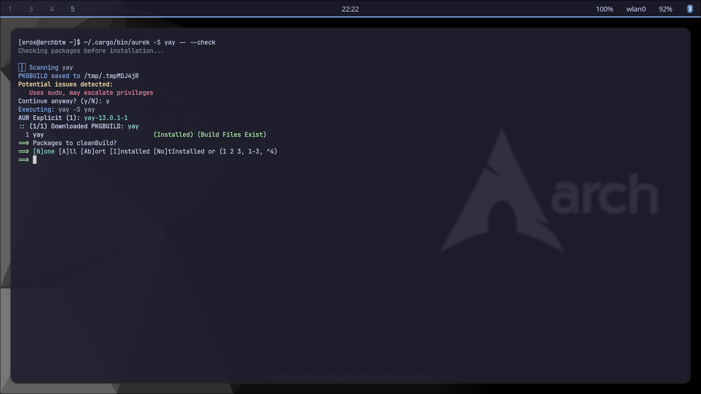

# aurek - AUR Security Checker

[](https://crates.io/crates/aurek)
[](https://www.rust-lang.org/)
[](https://opensource.org/licenses/MIT)
[](https://stardance.hackclub.com/)
[](https://github.com/Erox-02/aurek)

aurek is a security wrapper for `yay` that checks aur packages before installation.

aur packages are community-maintained and aren't vetted in the same way as packages from the official Arch repositories. A `pkgbuild` can execute arbitrary commands during installation, so installing one means trusting the code inside it.

aurek adds a security layer before that happens, using heuristic scanning and, optionally, a local LLM to look at the package with more context.

## v2.1.4

v2.1.4 makes aurek easier to use in day-to-day package management.

* **Scan by default** - `aurek -S package` now scans automatically
* **Config file support** - change aurek's behavior without adding flags every time
* **Better LLM output** - findings are grouped and explained more clearly
* **Colored output** - easier to tell warnings, findings and normal output apart
* `--no-scan` is available when a scan needs to be skipped
---

## Quick Start

Install a package normally:

```bash
aurek -S archey3
```

aurek will fetch the `pkgbuild`, scan it and show the findings before passing the package to `yay`.

To bypass scanning:

```bash
aurek -S archey3 --no-scan
```

For local LLM analysis:

```bash
aurek -S archey3 --model ~/models/gemma-4-E2B-it-Q4_K_M.gguf
```

---

## Features

* `pkgbuild` security scanning
* Scan-by-default installation workflow
* Optional local LLM analysis with Gemma
* Automatic `llama-server` management
* `yay` wrapper for normal package commands
* `paru` detection and warnings
* Colored terminal output
* Git fallback when the aur API is unavailable
* Configurable behavior through a config file
* Written in Rust



---

## Installation

### From Source

```bash
git clone https://github.com/Erox-02/aurek.git
cd aurek
cargo install --path .
```

### Manual Build

```bash
git clone https://github.com/Erox-02/aurek.git
cd aurek
cargo build --release
sudo cp target/release/aurek /usr/local/bin/
```

---

## Usage

### Install with a security scan

Scanning is enabled by default in v2.1.0:

```bash
aurek -S <package>
```

aurek fetches the `pkgbuild`, checks it for suspicious behavior, shows the results and, if everything is confirmed, passes the command to `yay`.

You can still explicitly use `--check`:

```bash
aurek -S <package> --check
```

### Skip the scan

If a scan isn't wanted for a particular command:

```bash
aurek -S <package> --no-scan
```

### LLM Analysis

```bash
aurek -S <package> --model /path/to/model.gguf
```

### Quiet Mode

```bash
aurek -S <package> --quiet
```

### Normal yay Commands

aurek can also be used for normal package management commands:

```bash
aurek -Syu
aurek -R <package>
aurek -Q
aurek -Ss <search>
```

---

## Configuration

aurek can be configured using either:

```text
/etc/aurek.conf
```

or:

```text
~/.config/aurek/aurek.conf
```

Example:

```ini
color = 1
llm_response_on_cli = 1
default_llm_model = /home/user/models/gemma.gguf
scan_by_default = 1
```

### Options

| Option                | Description                                    |
| --------------------- | ---------------------------------------------- |
| `color`               | Enable or disable colored output               |
| `llm_response_on_cli` | Show the LLM analysis directly in the terminal |
| `default_llm_model`   | Set a default GGUF model path                  |
| `scan_by_default`     | Enable or disable automatic scanning           |

For example, setting:

```ini
scan_by_default = 0
```

makes aurek behave more like the older versions, where scanning has to be explicitly requested.

---

## Example

A normal safe package might look something like:

```text
$ aurek -S archey3

aurek - AUR Security Checker
Checking package before installation...

Scanning archey3
pkgbuild saved to /tmp/.tmpF6Xz4F

No suspicious patterns detected.

Executing: yay -S archey3
```

If something suspicious is found:

```text
$ aurek -S suspicious-package

aurek - AUR Security Checker
Checking package before installation...

Scanning suspicious-package
pkgbuild saved to /tmp/.tmpG7Yz5G

Potential issues detected:

[#1] Remote Code Execution
    Downloads and executes a script from an external URL.

[#2] Privilege Escalation
    Uses sudo without clear verification.

Recommendation: review this package before installation.

Continue anyway? (y/N): n

Installation cancelled.
```

The exact findings depend on what is detected.

---

## Local LLM Analysis

Starting with v2.0.0, aurek can optionally use a local Gemma model through llama.cpp.

### Why local?

The LLM integration was designed to stay local:

* **Privacy** - the `pkgbuild` stays on the local machine
* **Offline use** - no external API is required
* **Context** - the model can look beyond simple pattern matching

### Setup

Install llama.cpp:

```bash
yay -S llama.cpp
```

or:

```bash
sudo pacman -S llama.cpp
```

Download a compatible Gemma GGUF model:

```bash
mkdir -p ~/models
cd ~/models

wget https://huggingface.co/unsloth/gemma-4-E2B-it-GGUF/resolve/main/gemma-4-E2B-it-Q4_K_M.gguf
```

Then run:

```bash
aurek -S <package> --model ~/models/gemma-4-E2B-it-Q4_K_M.gguf
```

aurek starts `llama-server`, waits for it to become ready, performs the analysis and shuts the server down when it's finished.

### Heuristics vs LLM

|          | Heuristics    | Local LLM        |
| -------- | ------------- | ---------------- |
| Speed    | Fast          | Slower           |
| Analysis | Pattern-based | Context-aware    |
| Privacy  | Local         | Local            |
| Setup    | Simple        | Requires a model |

The LLM is an additional layer, not a replacement for the heuristic scanner.

---

## Security Checks

### Heuristic Detection

aurek currently looks for potentially suspicious behavior including:

* Remote script execution (`curl \| sh`, `wget \| sh`)
* `sudo` usage
* Overly permissive permissions such as `chmod 777`
* Dangerous deletion commands
* `python -c` execution
* Base64 decoding
* `eval` usage
* Systemd service modification
* Cron job installation
* External URLs and network calls

### LLM Analysis

The local LLM can provide context-aware analysis for behavior that may not be obvious from individual patterns.

---

## How It Works

```text
             User
               |
               v
             aurek
               |
               v
        Scan enabled?
          /       \
        No         Yes
        |           |
        |      Fetch pkgbuild
        |       API / Git
        |           |
        |           v
        |    Heuristic Scan
        |           |
        |           v
        |    Optional LLM Scan
        |           |
        |           v
        |      Show Findings
        |           |
        +-----+-----+
              |
              v
             yay
              |
              v
      Package Installation
```

```
obviously the chart was drawn by deepseek.
```

---

## Limitations

aurek is a security layer, **not a guarantee that a package is safe**.

Static analysis has limits. Obfuscated code can be missed, dependencies can introduce their own risks, and runtime behavior isn't monitored.

False positives and false negatives are possible.

If a package looks suspicious, manual review is still recommended.

---

## Roadmap

### Planned

* Additional LLM models such as Mistral and Llama
* More advanced heuristics
* Recursive dependency scanning
* Package reputation system
* Support for more package managers
* Plugin system

---

## Development

```bash
git clone https://github.com/Erox-02/aurek.git
cd aurek

cargo build
cargo test
cargo build --release
cargo install --path .
```

---

## Contributing

Contributions are welcome.

Some areas where contributions would be useful:

* Security checks
* Heuristics
* Tests
* LLM integration
* Documentation

For larger changes, opening an issue before implementation is recommended.

---

## License

MIT License. See [LICENSE](LICENSE) for details.

---

## Links

* [GitHub](https://github.com/Erox-02/aurek)
* [Crates.io](https://crates.io/crates/aurek)
* [Author](https://github.com/Erox-02)
* [Hack Club Stardance](https://stardance.hackclub.com/)
